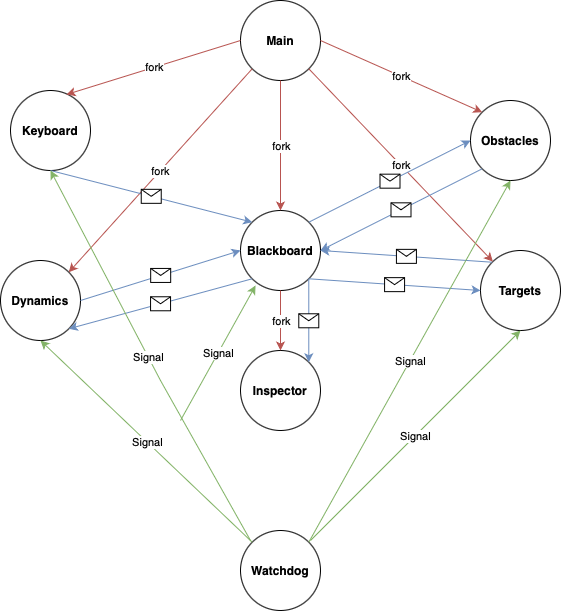

# Assignment 1: Drone Game

`Author` Gian Marco Balia\
`Student ID` 4398275\
`e-mail` s4398275@studenti.unige.it

`GitHub` https://github.com/balgian/DroneGame.git


Drone Game is a multi-process C project where a drone navigates through a a map filled with obstacles and targets. It utilizes interprocess communication via pipes and signals, with dedicated components for managing the game state, processing user input, computing drone dynamics, and monitoring processes. Built and tested on **Ubuntu 24.04** running on an **AMD processor**, with **C 17** and **CMake 3.28**. Follow the instructions below to set up and run the project.

## Requirements

To compile and run the project, the following dependencies must be installed:

- `ncurses` (for terminal handling)
- `CMake` (for build configuration)

### Installing Dependencies

If you don't have `CMake` or `ncurses` installed, follow these steps:

1. **Update your package list**:
   ```bash
   sudo apt update
   ```

2. **Install `CMake` and `ncurses`**:
   ```bash
   sudo apt install cmake libncurses5-dev
   ```
   
## Workspace
```
/DroneGame 
├── main
├── src
│   ├── blackboard.c
│   ├── drone_dynamics.c
│   ├── inspector_window.c
│   ├── keyboard_manager.c
│   ├── obstacles.c
│   ├── targets_generator.c
│   └── watchdog.c
├── include
│   └── macros.h
├── build
│   ├── debug
│   └── release
├── resources
│   └── assignment1scheme.png
├── 
├── README.md
└── CMakeLists.txt
```

## Building the Project

### Step 1: Create a build directory

Create a new directory inside `DroneGame`for building the project with

```bash
mkdir cmake-build && cd cmake-build
```

### Step 2: Configure the project with CMake

Run the following command to configure the project:

```bash
cmake ..
```

### Step 3: Compile the project

Once the configuration is complete, run `make` to compile the project:

```bash
make
```

## Running the Game

Once the project is successfully built, you can run the game with the following command:

```bash
./DroneGame
```
__NB__: When closed take some seconds.

## Project scheme

<p align="center">
  
</p>

__NB__: The mail symbol means pipe.

Actives componets:

- **Main**: Coordinates startup and shutdown by creating the logfile, pipes, and all child processes (including the blackboard and watchdog). Primitives used: fork(), pipe(), exec*(), waitpid(), kill(), signal handling, file I/O. Algorithms: Process creation/termination and interprocess communication (IPC) orchestration.
- **Blackboard**: Centralizes the game’s state (grid) and mediates communication between components. Primitives used: Pipes for IPC, signals, ncurses for UI rendering, file I/O for logging. Algorithms: Grid updates and Bresenham’s line algorithm to remove targets along a path.
- **Dynamics**: Computes the drone’s movement by combining user force with attractive/repulsive forces from obstacles and targets. Primitives used: Pipe I/O, signals, math functions (sqrt, pow), and file I/O. Algorithms: Basic physics simulation using equations of motion.
- **Inspector**: Provides a real-time UI that displays the drone’s status and a visual keypad via ncurses. Primitives used: FIFO for IPC, ncurses for window and UI management, file I/O. Algorithms: Continuous update loop to refresh display based on incoming status messages.
- **Keyboard**: Captures non-blocking user keyboard input and sends corresponding commands through a pipe.  Primitives used: ncurses (getch(), initscr(), nodelay()), pipe I/O, signal handling. Algorithms: Input mapping—translates key presses into game commands.
- **Obstacles**: Randomly places obstacle markers in the game grid while avoiding the center position. Primitives used: Random number generation (rand()), pipe I/O, signals. Algorithms: Simple grid population ensuring non-overlapping placement.
- **Targets**: Randomly generates and distributes numeric targets on the grid. Primitives used: Random number generation, pipe I/O, and basic file I/O for logging. Algorithms: Grid population that avoids conflicts with obstacles and the central position.
- **Watchdog**: Monitors the responsiveness of child processes by sending periodic heartbeat signals and terminates program if ones is unresponsive. Primitives used: Signals (SIGUSR1 for heartbeats, SIGTERM for termination), time functions (time(), difftime()), kill(). Algorithms: Heartbeat monitoring that checks time intervals to decide on process termination.


