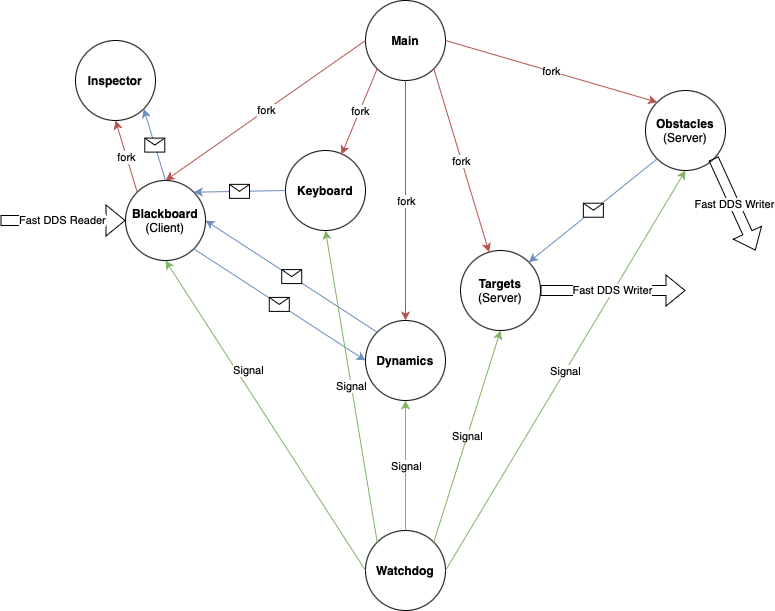

# Assignment 1: Drone Game 2

`Author` Gian Marco Balia\
`Student ID` 4398275\
`e-mail` s4398275@studenti.unige.it

`GitHub` https://github.com/balgian/DroneGame2.git


Drone Game 2 is a multi-process C project where a drone navigates through a a map filled with obstacles and targets, but now online! It utilizes interprocess communication via pipes and signals, with dedicated components for managing the game state, processing user input, computing drone dynamics, and monitoring processes and **TCP** communication with **Fast DDS 3.1.2 Discovery Server**. Built and tested on **Ubuntu 24.04** running on an **AMD processor**, with **C 17** and **CMake 3.28**. Follow the instructions below to set up and run the project.

## Requirements

To compile and run the project, the following dependencies must be installed:

- `ncurses` (for terminal handling)
- `fastcdr` (for TCP communication)
- `fastdds` (for TCP communication)
- `CMake` (for build configuration)

**NB**: It is tested with Fast DDS 3.1.2 version as reported in [TCP Communication with Discovery Server](https://fast-dds.docs.eprosima.com/en/latest/fastdds/use_cases/tcp/tcp_with_discovery_server.html). Previous versions couldn't work properly.\
Find here the [eProsima website Downloads tab](https://www.eprosima.com/product-download).

### Installing Dependencies

If you don't have `CMake` or `ncurses` installed, follow these steps:

1. **Update your package list**:
   ```bash
   sudo apt update
   ```

2. **Install `CMake` and `ncurses`**:
   ```bash
   sudo apt install cmake libncurses5-dev
   ```
   
3. **Install `Fast DDS 3.1.2`** from [eProsima website Downloads tab](https://www.eprosima.com/product-download) following [Linux installation from binaries](https://fast-dds.docs.eprosima.com/en/latest/installation/binaries/binaries_linux.html) or [Linux installation from sources](https://fast-dds.docs.eprosima.com/en/latest/installation/sources/sources_linux.html) tutorials.
   
## Workspace
```
/DroneGame2
├── main
├── src
│   ├── blackboard.c
│   ├── drone_dynamics.c
│   ├── inspector_window.c
│   ├── keyboard_manager.c
│   ├── obstacles.c
│   ├── targets_generator.c
│   └── watchdog.c
├── include
│   └── macros.h
├── idl
│   ├── Obstacles.idl
│   └── Targets.idl
├── resources
│   └── assignment2scheme.png
├── README.md
└── CMakeLists.txt
```

## Building the Project

### Step 1: Create a build directory

Create a new directory inside `DroneGame`for building the project with

```bash
mkdir cmake-build && cd cmake-build
```

### Step 2: Configure the project with CMake

Run the following command to configure the project:

```bash
cmake ..
```

### Step 3: Compile the project

Once the configuration is complete, run `make` to compile the project:

```bash
make
```

## Running the Game

Once the project is successfully built, you can run the game with the following command:

```bash
./DroneGame
```
__NB__: When closed take some seconds.

## Project scheme

<p align="center">
  
</p>

__NB__: 

- The mail symbol means pipe.
- In `/DroneGame2/include/macros.h` there are define the IPv4s and port numbers to configure the communication to receive and send data.

Actives components:

- **Main**: Coordinates startup and shutdown by creating the logfile, pipes, and all child processes (including the blackboard and watchdog). Primitives used: fork(), pipe(), exec*(), waitpid(), kill(), signal handling, file I/O. Algorithms: Process creation/termination and interprocess communication (IPC) orchestration.
- **Blackboard**: It is the central hub of the game by managing the game grid state and mediates the communication among components. In addition to traditional IPC methods (pipes, FIFO, and signals) and UI rendering with ncurses, it integrates DDS subscribers (using FastDDS) to receive data on obstacles and targets from dedicated processes. Primitives used: FastDDS (DomainParticipant, DataReader, etc.), pipes, FIFO, signals, ncurses, fork()/exec(), file I/O. Algorithms: Scaling and updating the grid, Bresenham’s line algorithm to remove targets along a path, and coordinate transformation to integrate DDS data.
- **Dynamics**: Computes the drone’s movement by combining user force with attractive/repulsive forces from obstacles and targets. Primitives used: Pipe I/O, signals, math functions (sqrt, pow), and file I/O. Algorithms: Basic physics simulation using equations of motion.
- **Inspector**: Provides a real-time UI that displays the drone’s status and a visual keypad via ncurses. Primitives used: FIFO for IPC, ncurses for window and UI management, file I/O. Algorithms: Continuous update loop to refresh display based on incoming status messages.
- **Keyboard**: Captures non-blocking user keyboard input and sends corresponding commands through a pipe.  Primitives used: ncurses (getch(), initscr(), nodelay()), pipe I/O, signal handling. Algorithms: Input mapping—translates key presses into game commands.
- **Obstacles**: Randomly places obstacle markers in the game grid while avoiding the center position. This component uses FastDDS to publish obstacle data on “**_topic 1_**” and simultaneously sends the grid configuration via a pipe to Targets. Primitives used: FastDDS (DomainParticipant, Publisher, DataWriter), TCPv4TransportDescriptor for transport configuration, signals, pipes, random number generation (rand()), file I/O. Algorithms: Random grid population ensuring non-overlapping placement of obstacles, and timed synchronization.
- **Targets**: Randomly generates and distributes numeric targets on the grid, ensuring they do not overlap with obstacles or the drone’s starting position. It uses FastDDS to publish target data on “**_topic 2_**” and, by reading the updated grid via a pipe, places targets in decreasing order (from '9' to '0'). Primitives used: FastDDS (DomainParticipant, Publisher, DataWriter), TCPv4TransportDescriptor for communication, signals, pipes, random number generation, file I/O. Algorithms: Grid population algorithm for target placement and ordered numbering.
- **Watchdog**: Monitors the responsiveness of child processes by sending periodic heartbeat signals and terminates program if ones is unresponsive. Primitives used: Signals (SIGUSR1 for heartbeats, SIGTERM for termination), time functions (time(), difftime()), kill(). Algorithms: Heartbeat monitoring that checks time intervals to decide on process termination.


